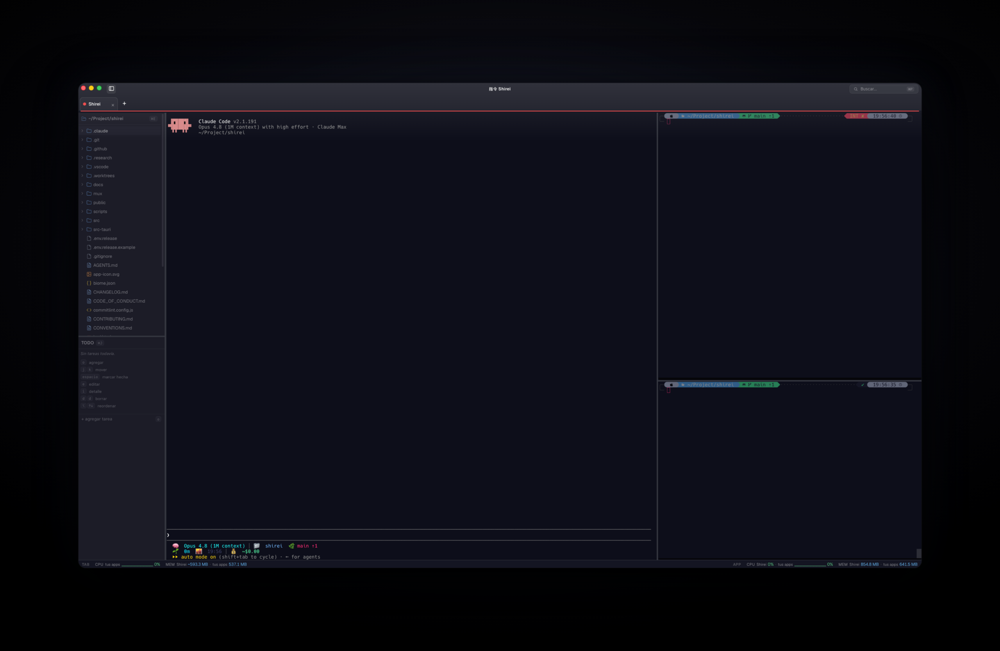

# Shirei 指令

**A keyboard-first terminal cockpit for AI coding on macOS.**

[](https://github.com/zeroblack/shirei/releases/latest)
[](https://github.com/zeroblack/shirei/actions)
[](#distribution-signed--notarized)
[](#stack)
[](LICENSE)
[](#build-from-source)

<p align="center">
  
</p>

## What is Shirei?

Shirei is the inverse of an IDE. Where editors keep your files at the center and
bolt AI on the side, Shirei puts the **AI CLI session at the center** and keeps the
editor, files, and search as satellites — instruments arranged around the session
so you never have to leave it.

It's built for long sessions with CLIs like Claude Code: see, open, edit, search,
and review everything the session produces, all without touching the mouse.

> It's not an editor with a terminal. It's a terminal where the editor exists only
> to keep the session flowing.

Shirei does **not** embed its own AI. It's the optimal environment to *run* external
AI CLIs — the session is the cockpit, not an assistant bolted to the side.

**Bring your own CLI.** Shirei never sees, stores, or proxies your API keys. Each CLI signs in with your own account, so there are no keys to hand over, nothing billed through Shirei, and no lock-in.

## Why

When you run long AI coding sessions, the friction isn't the model — it's everything
that pulls you out of the session: switching to an editor, hunting for a file, losing
the thread. Shirei keeps you in the cockpit. The session stays in front of you, and
everything you need to act on its output is one keystroke away.

## Features

- **Keyboard-first.** Every frequent action has a shortcut, following the conventions
  you already know from your terminal and editor. No mouse required.
- **Renameable, color-coded tabs.** Double-click to rename, click the dot (or
  right-click) to color. Name and color survive restarts, so you know which project
  you're in at a glance.
- **Splittable panels.** Split right or down, move between panes, zoom into one.
- **Per-project layouts.** Each project recreates its layout — panels plus the
  programs they run — on launch. Edit them from Settings.
- **Session snapshots.** On reopen, every pane returns to its folder and, by your
  preference, relaunches what it was running (all / templates only / none).
- **File tree (`Cmd+B`).** The active terminal's directory, with type icons, fully
  keyboard-navigable.
- **Open files in tabs.** A light editor (CodeMirror — syntax highlighting, save with
  `Cmd+S`, a readable line width for prose), an image viewer, and a video/audio
  player. File tabs reopen on restart.
- **Command palette (`Cmd+P`).** Launch a project or jump to a file in the active
  directory, without cluttering the screen with pinned tabs.
- **Built-in screen recording (`Ctrl+Cmd+R`).** Capture a pane, the app window, or a
  selected region to MP4 or GIF — keyboard-triggered, with a live indicator.
- **Impeccable rendering.** xterm.js on a WebGL renderer, so box-drawing, tool-call
  trees, and full-screen TUIs render exactly right. Pure-black theme by default.
- **The window survives close.** Closing hides it; it returns from the dock with the
  session intact.
- **Nothing hardcoded.** Fonts (bundled), theme, colors, shortcuts, limits and
  projects all live in `config.json`, editable from Settings (`Cmd+,`).

## Keyboard shortcuts

**Tabs:** `Cmd+T` new · `Cmd+W` close pane (or tab) · `Cmd+1-9` jump to tab ·
`Cmd+←/→` cycle · `Cmd +/-/0` font size.

**Panels:** `Cmd+D` split right · `Cmd+Shift+D` split down ·
`Cmd+Shift+←/→/↑/↓` move between panes · `Cmd+Shift+Enter` zoom ·
`Cmd+Shift+G` save the project layout · `Cmd+Shift+L` save the session as a template.

**Files & more:** `Cmd+B` file tree · `Cmd+R` refresh the tree · `Cmd+P` command
palette · `Cmd+S` save · `Ctrl+Cmd+R` record screen · `Cmd+,` settings.

## Build from source

**Prerequisites:** macOS, [Rust](https://rustup.rs), [pnpm](https://pnpm.io), and the
Xcode command line tools (`xcode-select --install`).

```bash
pnpm install
pnpm tauri dev      # run the app
pnpm tauri build    # produce a release bundle
```

### Distribution (signed + notarized)

For a `.dmg` that opens on any Mac without Gatekeeper warnings, the bundle must be
notarized with Apple. Copy `.env.release.example` to `.env.release`, fill in your App
Store Connect API key credentials, and run:

```bash
pnpm release
```

The script validates the credentials and delegates to `pnpm tauri build`, which signs
with your Developer ID, notarizes, and staples the ticket to the bundle.
`.env.release` is gitignored and the `.p8` stays outside the repo.

## Stack

Tauri 2 · Rust · TypeScript + Vite · xterm.js (WebGL) · CodeMirror. The system
WebView — no bundled Chromium.

## Scope

A personal tool, macOS-only. A terminal with panels, projects, a file explorer and a
light editor, built to host external AI CLIs. No LSP, debugger, extension marketplace,
git GUI, SSH, or built-in AI. The editor exists to read and touch what the session
produces, not to write features by hand.

## Support

Shirei is free and open source. If it helps you and you'd like to see it grow, you can
sponsor it on [GitHub Sponsors](https://github.com/sponsors/zeroblack).

## License

[MIT](LICENSE)

Built by [Dioni](https://dioni.dev/).
